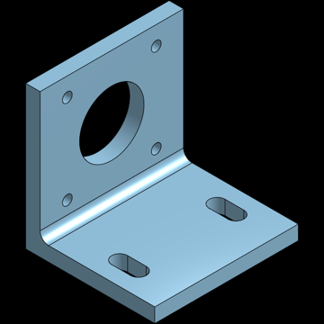
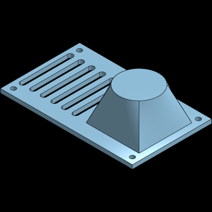
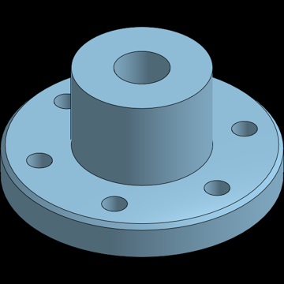
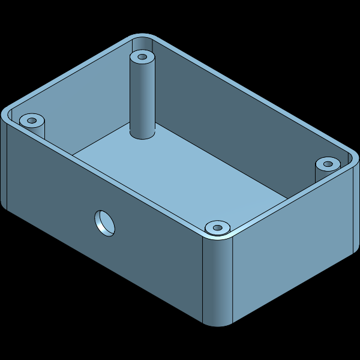
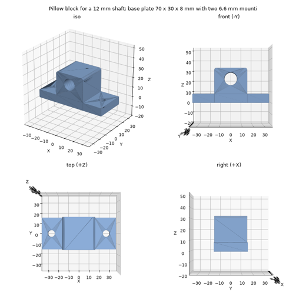

# onshape-fsgen

**Describe a part in words, get a parametric Onshape part.** An LLM designs the part as FeatureScript; fsgen
checks and builds it locally, then delivers it to Onshape either as a **native, editable feature tree** or as a
**custom feature you paste in for free**.

   

| NEMA 17 motor mount | Fan adapter | Flange | Enclosure |
|:---:|:---:|:---:|:---:|
|  |  |  |  |
| from a one-line prompt, 23 features | from a prompt: loft + linear pattern | revolve, bolt pattern, chamfer | shell, bosses, offset plane |

*Rendered by Onshape. Every part is an ordinary Onshape feature tree: open any sketch, change `#width`, and the
model updates.*

## Why this exists

- **Editable results, not dead geometry.** Most text-to-CAD tools hand you a mesh, a STEP, or one opaque custom
  feature. fsgen builds the tree a person would: Variables, constrained and dimensioned Sketches, Extrudes,
  Revolves, Fillets, Patterns. Sketch dimensions are live expressions like `#width / 2 - #holeInset`.
- **Built for Onshape's API limits.** Education plans get 2,500 API calls *per year*. fsgen does everything it can
  offline, shows the cost before each push (e.g. "13 calls = 0.7 % of what's left"), re-pushes only changed
  features, and offers a **0-call paste workflow**.
- **A local builder that agrees with Onshape.** An OpenCascade engine reproduces Onshape's feature semantics, so
  the LLM can iterate and review offline. It matches Onshape's volume on every reference part, and its quirks
  were measured against the real thing (see [findings](docs/FINDINGS.md)).
- **Learns features on the way.** All 98 Onshape standard features are callable; parameters are validated
  against Onshape's own feature specs, and features that build successfully are added to a catalog of examples.

## How it works

```
"60 x 40 mm plate with four M4 holes"
        │
        ▼  LLM (Claude) writes a Part Studio script: FeatureScript calling standard features + #variables
        │
        ▼  offline, 0 API calls
   checker:        syntax, units, feature/parameter/enum ids vs. Onshape's feature specs
   local builder:  geometry, volume, hole sizes, 4-view preview  ──► LLM review / your feedback
   cost estimate:  calls needed to push
        │
   ┌────┴─────────────────────────┐
   ▼                              ▼
paste export (0 calls)       native feature tree via the REST API
one custom feature with      1 call per feature, incremental updates,
a parameter dialog           1 call to confirm Onshape's volume = local
```

<p align="center"><br>
<em>Local preview the LLM reviews before anything is sent to Onshape</em></p>

### Example: a 3D-printable screwdriver with threads

<p align="center"></p>

A handle for the NEO Tools 04-227 precision bits, designed in a chat from a description with the product's
dimensions looked up online: three parts laid out in print orientation, an M12 × 2 thread with a collet nut
that clamps the bit, and a snap-on end cap. The thread and fits were checked locally (the nut screws on without
overlap). Script: [examples/native/generated/neo_screwdriver.fs](examples/native/generated/neo_screwdriver.fs).

## Quick start

Requirements: Python 3.12, an Onshape account with API keys (*My Account → Developer → API keys*), and
[Claude Code](https://claude.com/claude-code) logged in (or an `ANTHROPIC_API_KEY`).

```bash
git clone https://github.com/Lucasfrit/onshape-fsgen && cd onshape-fsgen
python3.12 -m venv .venv && .venv/bin/pip install -e . pytest
cp .env.example .env          # add your Onshape API keys
.venv/bin/pytest              # offline test suite, no API calls
```

**In a Claude Code chat** (you steer between iterations):

```
/make-part a 60 x 40 x 5 mm mounting plate with four 4.5 mm holes 6 mm from the corners and 3 mm corner fillets
```

**Or with one command:**

```bash
.venv/bin/fsgen generate "…description…" --paste --name "My part"      # 0 API calls → paste_feature.fs
.venv/bin/fsgen generate "…description…" --name "My part" --budget 40  # native feature tree in Onshape
```

To paste: create a Feature Studio in Onshape, paste the file, and insert the feature in a Part Studio.

## Two ways into Onshape

| | **Paste** a custom feature | **Push** a native tree |
|---|---|---|
| API calls | 0 | ≈ features + 5 (a 9-feature part: 14) |
| In Onshape | one feature with a parameter dialog | separate Sketch / Extrude / Fillet / … features |
| Later edits | change parameters in the dialog | edit any sketch, dimension or feature; re-push costs 1–2 calls |
| Checked first | yes, locally | yes, locally + 1-call volume check in Onshape |

## What it can build today

Sketches (lines, arcs, circles, rectangles, polylines, polygons) on default or offset planes · extrude
(new / add / remove / intersect, blind, through-all, symmetric, two directions) · revolve · loft · fillet ·
chamfer · shell · booleans · linear / circular / mirror feature patterns (including patterns of patterns) ·
helix + sweep (threads). Not yet: draft, sheet metal, surfaces. Full table:
[docs/CAPABILITIES.md](docs/CAPABILITIES.md).

Also: **STEP → editable tree** (`fsgen recognize part.step`) using
[featuretree](https://github.com/punkfab/featuretree)'s feature recognition, for prismatic parts.

## Main commands

| command | what it does | Onshape calls |
|---|---|---|
| `fsgen generate "…" [--paste]` | prompt → script → local build/review → paste file or native tree | 0 / ≈ features + 5 |
| `fsgen studio build file.fs` | local build: STEP, STL, preview, cost estimate | 0 |
| `fsgen studio paste file.fs` | custom feature to paste (clipboard) | 0 |
| `fsgen studio push file.fs` | create / update the native tree incrementally | as estimated |
| `fsgen recognize part.step` | STEP → editable Part Studio script | 0 |
| `fsgen features [type]` | feature catalog / one feature's parameters | 0 |
| `fsgen usage` | API calls used and left | 0 |

All commands and options: [docs/REFERENCE.md](docs/REFERENCE.md).

## Documentation

- [docs/CAPABILITIES.md](docs/CAPABILITIES.md): what runs locally vs. in Onshape, feature table, local builder.
- [docs/FINDINGS.md](docs/FINDINGS.md): Onshape API and FeatureScript behaviours discovered along the way
  (undocumented quirks, call accounting, what costs what). Useful even if you don't use fsgen.
- [docs/REFERENCE.md](docs/REFERENCE.md): commands, the script dialect, rules, adding features.
- [rules.md](rules.md): the modelling rules the LLM follows (edit to taste).

## Status and limitations

Experimental: built and tested by one person over a few sessions. Dimensions the description
doesn't give are assumed (and listed in `assumptions.md`) or looked up on the web. Sketches on
part faces and several advanced features are not supported yet. Not affiliated with Onshape or PTC.

## Credits and license

- STEP feature recognition: [featuretree](https://github.com/punkfab/featuretree) (MIT), vendored in
  `third_party/featuretree` with its license.
- Geometry: [build123d](https://github.com/gumyr/build123d) / OpenCascade (OCP).
- Onshape behaviours were measured with the public Onshape REST API and FeatureScript documentation.

MIT License, see [LICENSE](LICENSE).
