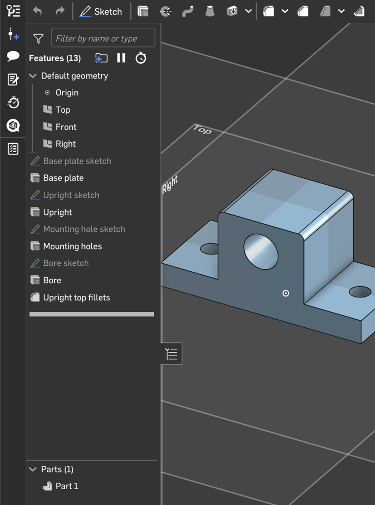
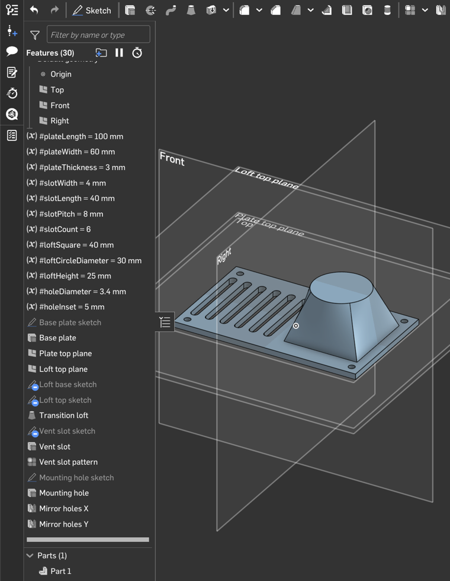
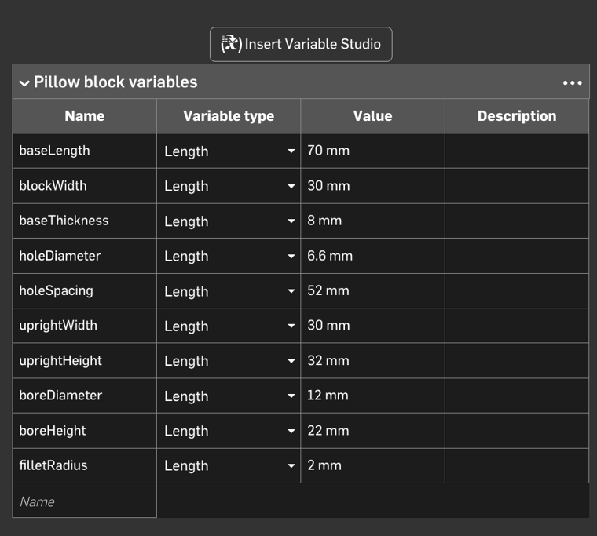
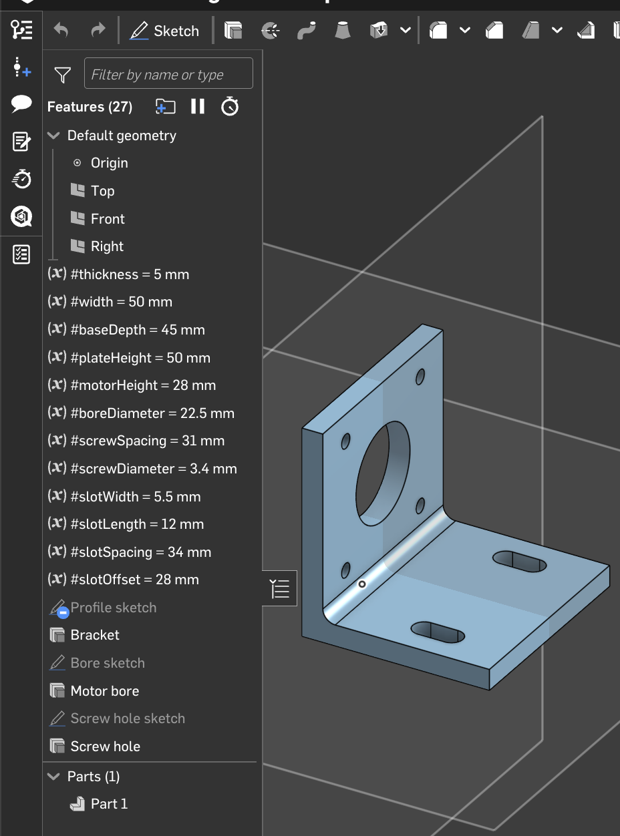
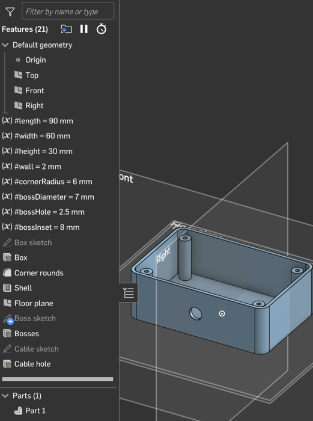
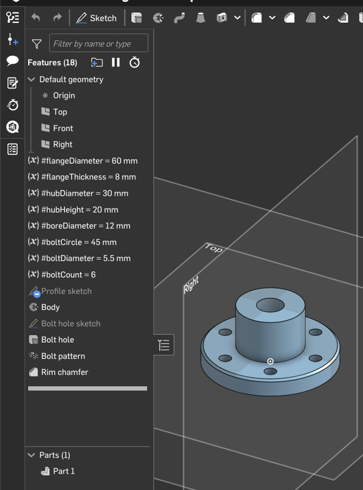
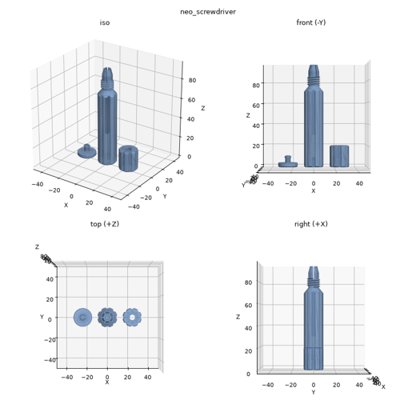

# onshape-fsgen

**Describe a part in words and get a real Onshape part: sketches, extrudes and fillets in the feature tree,
exactly as if you had modelled it yourself, and every one of them editable afterwards.**

   

<p align="center">
  
  &nbsp;
  
</p>
<p align="center"><em>Generated from one-line descriptions: a pillow block and a fan adapter, as ordinary
Onshape feature trees (screenshots from Onshape). Nothing is imported geometry; fsgen created every sketch and
feature through the Onshape API.</em></p>

## What makes it different

LLM-generated 3D models are easy to find, but they arrive as a mesh, a STEP file or one opaque block of code:
geometry you can look at but not really edit. fsgen builds the part **the way a person would in Onshape**:

- **Variables** for every key dimension, either in a Variable Studio (default, shown below) or at the top of the
  tree (`#slotLength = 40 mm`, `#boltCount = 6`), edited like any Onshape variable.
- **Sketches with constraints and dimensions**, driven by those variables: rectangles, circles, slots and
  profiles are dimensioned with live expressions such as `#width / 2 - #holeInset`. Change a variable and the
  sketch, and everything built on it, updates.
- **Standard features**: Extrude (new / add / remove), Revolve, Loft, Sweep along a helix (threads), Fillet,
  Chamfer, Shell, Plane, Linear / Circular / Mirror patterns, Boolean… with readable names ("Base plate",
  "Vent slot pattern", "Inside fillet").
- **Edit anything afterwards** in Onshape, by hand, or by changing the script and pushing again; fsgen then
  updates only the features that changed.

All 98 Onshape standard features can be used; parameters are checked against Onshape's own feature
definitions before anything is sent.

<p align="center"><br>
<em>The pillow block's variables in its Variable Studio: change a value and the part updates.</em></p>

<details>
<summary><b>More generated parts</b> (NEMA 17 motor mount, enclosure, flange)</summary>
<br>
<p align="center">
  
  
  
</p>
<p align="center"><em>NEMA 17 mount (27 features, slots, mirrored screw holes, inside fillet) · enclosure (shell,
rounded corners, bosses on an offset plane, cable hole) · flange (revolve, bolt-hole circular pattern, chamfer)</em></p>
</details>

## How it works

```
"60 x 40 mm plate with four M4 holes and rounded corners"
        │
        ▼  an AI (Claude by default, or another LLM) writes a Part Studio script:
        │  FeatureScript calling Onshape's standard features + #variables
        │
        ▼  checked and test-built on your computer first (no API calls)
        │
        ▼  sent to Onshape feature by feature  ──►  an editable feature tree in a new Part Studio
```

The local test build is a supporting tool, not the point: an OpenCascade engine that reproduces Onshape's
feature behaviour, so mistakes are caught and fixed before they cost API calls, and the result can be checked
(sizes, holes, volume, a preview image). Onshape's education plans allow 2,500 API calls per year, so fsgen
shows the cost before each push (a typical part: about 15–30 calls) and re-sends only what changed.

If you don't need to edit the sketches later, there is a **0-call alternative**: the same part as one
parametric custom feature that you paste into a Feature Studio and adjust through its parameter dialog.

### Example: a 3D-printable screwdriver with threads

<p align="center"></p>

A handle for the NEO Tools 04-227 precision bits, designed in a chat with the product's dimensions looked up
online: three parts laid out for printing, an M12 × 2 thread with a collet nut that clamps the bit, and a
snap-on end cap (local preview; the fit of the thread was checked locally). Script:
[examples/native/generated/neo_screwdriver.fs](examples/native/generated/neo_screwdriver.fs).

## Quick start

Requirements: Python 3.12, an Onshape account with API keys (*My Account → Developer → API keys*), and an AI to
do the designing (see [Which AI?](#which-ai) — Claude works out of the box).

```bash
git clone https://github.com/Lucasfrit/onshape-fsgen && cd onshape-fsgen
python3.12 -m venv .venv && .venv/bin/pip install -e . pytest
cp .env.example .env          # add your Onshape API keys
.venv/bin/pytest              # offline test suite, no API calls
```

**In a chat with your coding assistant** (you steer between iterations). In Claude Code:

```
/make-part a 60 x 40 x 5 mm mounting plate with four 4.5 mm holes 6 mm from the corners and 3 mm corner fillets
```

Other assistants (Codex, Cursor, Copilot, Gemini CLI, …) read the same workflow from
[AGENTS.md](AGENTS.md): ask them to "make a part: …" in this folder.

**Or with one command:**

```bash
.venv/bin/fsgen generate "…description…" --paste --name "My part"      # 0 API calls → paste_feature.fs
.venv/bin/fsgen generate "…description…" --name "My part" --budget 40  # native feature tree in Onshape
```

To paste: create a Feature Studio in Onshape, paste the file, and insert the feature in a Part Studio.

## Which AI?

fsgen is not tied to one model: the AI only has to write a text file (the Part Studio script); checking,
building and talking to Onshape is done by fsgen.

| how you work | AI | setup |
|---|---|---|
| chat with a coding assistant | Claude Code (`/make-part`), Codex, Cursor, Copilot, Gemini CLI, … | none: they follow [AGENTS.md](AGENTS.md) and run `fsgen spec` / `fsgen studio build` / `paste` / `push` |
| one command, `fsgen generate` | Claude (default) | logged-in `claude` CLI, or `ANTHROPIC_API_KEY` |
| one command, `fsgen generate` | any LLM with a command-line tool: local models via Ollama, Gemini CLI, `llm`, … | `FSGEN_LLM_COMMAND="ollama run qwen2.5-coder:32b"` (prompt on stdin, answer on stdout) |
| by hand | you | write the script yourself; `fsgen studio build` checks it |

So far it has been used and tested with Claude; other models should work through the same interface, but how
well they write FeatureScript is untested. Results improve with models that can read the preview image and
search the web.

## Two ways into Onshape (native tree is the main one)

| | **Paste** a custom feature | **Push** a native tree |
|---|---|---|
| API calls | 0 | ≈ features + 5 (a 9-feature part: 14) |
| In Onshape | one feature with a parameter dialog | separate Sketch / Extrude / Fillet / … features |
| Later edits | change parameters in the dialog | edit any sketch, dimension or feature; re-push costs 1–2 calls |
| Checked first | yes, locally | yes, locally + 1-call volume check in Onshape |

## What it can build today

Sketches (lines, arcs, circles, rectangles, polylines, polygons) on default or offset planes · extrude
(new / add / remove / intersect, blind, through-all, symmetric, two directions) · revolve · loft · fillet ·
chamfer · shell · booleans · linear / circular / mirror feature patterns (including patterns of patterns) ·
helix + sweep (threads). Not yet: draft, sheet metal, surfaces. Full table:
[docs/CAPABILITIES.md](docs/CAPABILITIES.md).

Also: **STEP → editable tree** (`fsgen recognize part.step`) using
[featuretree](https://github.com/punkfab/featuretree)'s feature recognition, for prismatic parts.

## Main commands

| command | what it does | Onshape calls |
|---|---|---|
| `fsgen generate "…" [--paste] [--llm-command "…"]` | prompt → script → local build/review → paste file or native tree | 0 / ≈ features + 5 |
| `fsgen studio build file.fs` | local build: STEP, STL, preview, cost estimate | 0 |
| `fsgen studio paste file.fs` | custom feature to paste (clipboard) | 0 |
| `fsgen studio push file.fs` | create / update the native tree incrementally | as estimated |
| `fsgen recognize part.step` | STEP → editable Part Studio script | 0 |
| `fsgen features [type]` | feature catalog / one feature's parameters | 0 |
| `fsgen usage` | API calls used and left | 0 |

All commands and options: [docs/REFERENCE.md](docs/REFERENCE.md).

## Documentation

- [docs/CAPABILITIES.md](docs/CAPABILITIES.md): what runs locally vs. in Onshape, feature table, local builder.
- [docs/FINDINGS.md](docs/FINDINGS.md): Onshape API and FeatureScript behaviours discovered along the way
  (undocumented quirks, call accounting, what costs what). Useful even if you don't use fsgen.
- [docs/REFERENCE.md](docs/REFERENCE.md): commands, the script dialect, rules, adding features.
- [rules.md](rules.md): the modelling rules the LLM follows (edit to taste).

## Status and limitations

Experimental: built and tested by one person over a few sessions. Dimensions the description
doesn't give are assumed (and listed in `assumptions.md`) or looked up on the web. Sketches on
part faces and several advanced features are not supported yet. Not affiliated with Onshape or PTC.

## Credits and license

- STEP feature recognition: [featuretree](https://github.com/punkfab/featuretree) (MIT), vendored in
  `third_party/featuretree` with its license.
- Geometry: [build123d](https://github.com/gumyr/build123d) / OpenCascade (OCP).
- Onshape behaviours were measured with the public Onshape REST API and FeatureScript documentation.

MIT License, see [LICENSE](LICENSE).
